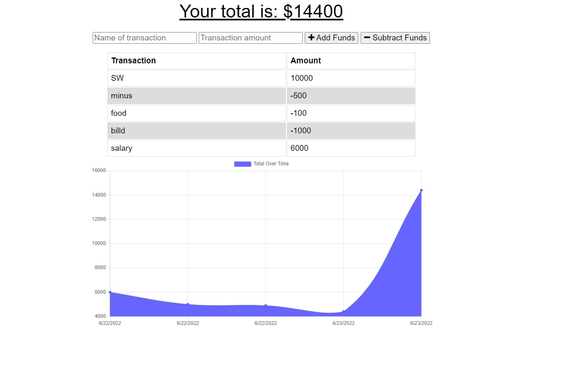

# Social-Network-API

## Description 
This project is an API for a social network web application where users can share their thoughts, react to friends’ thoughts, and create a friend list. This application uses MongoDB, Express.js, and Mongoose. 

## Table of Contents
* [Installation](#installation)
* [Usage](#usage)
* [Author](#author)

## Installation 
The user should clone the repository from GitHub. This application requires Express, MongoDB, and Mongoose. Make sure your local device has MongoDB installed. Then clone git repository and run `npm install i`. Once dependencies are installed run `npm start` to connect to server.

## Usage 
This application allows users to budget their finances easily. They can add money coming in and subtract money going out, the results can be seen in a graph which shows how your finances are trending.
App can be accessed on [Heroku](https://budget-tracker-easy.herokuapp.com/) 

## Author
Ansab Sidiki [Github](https://github.com/asidiki).